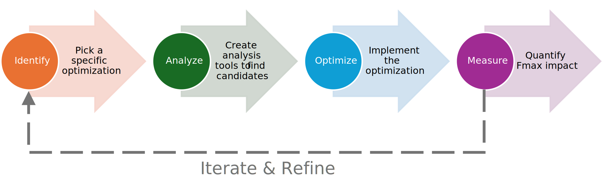
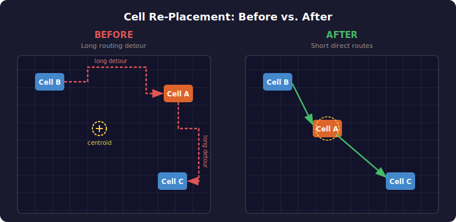

# Optimization Example

One major way to improve your agent is by creating new backend optimizations or "recipes."  In fact, we hope that you focus most of your development effort in this area ahead of time so that the LLM resources at runtime only have to choose from the available set of optimization options rather than attempting to invent them on-the-fly (which would be both expensive in both time expended and tokens).  Using AI coding agents for development is fully allowed and encouraged to help you in building out these recipes.

To help you get started, here is a simple pattern to follow that can provide success when tackling design optimization.  

---

## The Optimization Recipe Pattern

Physical optimizations can follow this simple four-step cycle:

[](assets/OptimizationRecipe.svg)

| Step | Goal | Typical Tools |
|------|------|---------------|
| **1. Identify** | Pick a specific physical optimization target | Domain knowledge, literature review |
| **2. Analyze** | Build a tool to find where this optimization applies | Vivado timing reports, RapidWright analysis scripts |
| **3. Optimize** | Implement the transformation | RapidWright APIs, Vivado ECO commands |
| **4. Measure** | Quantify the impact on Fmax | Vivado `report_timing_summary` |

The cycle is meant to be iterated: measure results, refine the analysis heuristics, tune the optimization parameters, and repeat.  Different benchmarks will exhibit different optimization opportunites and will be layered like an onion.  When you solve some of the outer ones, there will be different optimization opportunities underneath.

---

## Example Recipe: Critical Path Cell Re-Placement

### The Idea

After place-and-route, some cells on critical paths may be placed far from their ideal location.  (Perhaps the first critical paths encountered in a design would not normally experience this, however, after substantial progress is made in optimizing the first set of critical paths, other paths that become critical may experience this). This causes the router to take long detours, consuming timing margin.  If we can detect these cases and surgically move cells closer to the centroid of their connections, the router can find shorter paths and timing improves.

[](assets/cell-replacement-before-after.svg)

---

### Step 1 — Identify the Opportunity

Here is our heuristic: A critical path is **sub-optimal due to placement** when a net segment's *routed path length* (through actual routing PIPs) is significantly longer than the *Manhattan distance* between its source and sink tiles.  We call this ratio the **detour ratio**:

```
detour_ratio = routed_path_length / manhattan_distance
```

A detour ratio of 1.0 means the route is perfectly direct.  Ratios above ~2.0 suggest the cell may benefit from re-placement.  The cell should only be moved if the surrounding path segments have adequate slack to absorb any perturbation.

---

### Step 2 — Build the Analysis Tool

We implement this as an MCP tool (`analyze_net_detour`) in `RapidWrightMCP/rapidwright_tools.py` so the agent can call it directly.

#### 2a. Computing the Detour Ratio

The core idea is to walk backward through a net's PIPs from a sink pin to the source, summing tile-to-tile Manhattan distances to get the *routed path length*.  The **detour ratio** is then:

```
detour_ratio = routed_path_length / manhattan_distance(source_tile, sink_tile)
```

In pseudo-code:

```
compute_routed_path_length(net, sink_pin):
    build node_map from net's PIPs  (end_node → start_node)
    walk backward from sink_pin's node to source_pin's node
    sum tile Manhattan distances at each hop
    return total length

detour_ratio(net, sink_pin):
    manhattan = source_tile.getManhattanDistance(sink_tile)
    return compute_routed_path_length(net, sink_pin) / manhattan
```

See `_compute_routed_path_length()` and `_detour_ratio()` in `rapidwright_tools.py` for the full implementation.

#### 2b. The Full Analysis Tool

The `analyze_net_detour` tool performs a **cell-centric** analysis.  For each interior cell on the critical path, it examines both the *incoming* net (feeding the cell) and the *outgoing* net (driven by it).  A high detour ratio on either side is evidence the cell is poorly placed.

The input is a **pin-path** list as produced by `extract_critical_path_pins`:

```
["src_ff/Q", "lut1/I2", "lut1/O", "lut2/I0", "lut2/O", "dst_ff/D"]
```

Consecutive pins from the same cell (e.g. `lut1/I2`, `lut1/O`) identify the cell's data path:

```
analyze_net_detour(pin_paths, detour_threshold):
    for each pin_path:
        resolve each pin name → EDIFHierPortInst
        group consecutive pins belonging to the same cell → (in_pin, out_pin)

        for each (in_pin, out_pin):
            for each pin:
                get the physical net and SitePinInst
                if output pin → check detour to all sink pins (max)
                if input pin  → check detour to this pin
            record max detour ratio

    return cells where max_detour_ratio > threshold, sorted descending
```

For output pins, we iterate over all sink pins because the `SitePinInst` is the net's *source* — checking it against itself would yield zero distance.  Taking the max across sinks catches cells whose outgoing net has a long detour.

See `analyze_net_detour()` in `rapidwright_tools.py` for the full implementation.

#### 2c. Chaining Vivado and RapidWright

The analysis requires data from both tools:

1. **Vivado** `extract_critical_path_pins` — extracts ordered pin paths from the timing report
2. **Vivado** `report_timing_summary` — provides baseline WNS/TNS and per-path slack
3. **RapidWright** `analyze_net_detour` — compares Manhattan distance to routed path length

---

### Step 3 — Implement the Optimization

The `optimize_cell_placement` MCP tool moves candidate cells to the centroid of their connections:

```
optimize_cell_placement(cell_names):
    for each cell:
        1. Collect tile locations of all connected pins
        2. Compute centroid (ideal placement) using ECOPlacementHelper
        3. Unplace cell and unroute its nets
        4. Spiral outward from centroid to find an empty compatible site
        5. Place cell at new site and re-route intra-site wiring
```

The key steps in more detail:

- **Centroid calculation** — `ECOPlacementHelper.getCentroidOfPoints()` computes the arithmetic mean of all connected pin tile coordinates and snaps to the nearest SLICE site.
- **Spiral search** — `ECOPlacementHelper.spiralOutFrom()` iterates neighboring sites outward until an empty compatible site is found.
- **Unplace/place** — `DesignTools.fullyUnplaceCell()` cleanly removes the cell's physical placement; `design.placeCell()` and `siteInst.routeSite()` establish the new placement with correct intra-site routing.
- **Net unrouting** — `net.unroute()` clears PIPs so Vivado's `route_design` will incrementally re-route only the affected nets.

See `optimize_cell_placement()` and `_get_cell_physical_nets()` in `rapidwright_tools.py` for the full implementation.

---

### Step 4 — Measure the Impact

After re-placing cells in RapidWright, write the modified checkpoint and use Vivado to re-route and re-time:

```
rapidwright:  write_checkpoint("optimized.dcp")
vivado:       open_checkpoint("optimized.dcp")
vivado:       route_design                      ← re-routes only the unrouted nets
vivado:       report_timing_summary             ← compare new WNS to baseline
```

Because `optimize_cell_placement` calls `net.unroute()` on every net connected to the moved cells, Vivado's `route_design` will incrementally re-route only those nets—the rest of the design stays intact.

---

## Putting It All Together

Here is the complete sequence of MCP tool calls an agent would make:

```
 ┌─── Baseline ──────────────────────────────────────────────────────────┐
 │ 1. vivado:  open_checkpoint(input.dcp)                                │
 │ 2. vivado:  report_timing_summary  → baseline WNS                     │
 │ 3. vivado:  extract_critical_path_pins(clock_filter=contest_clock)    │
 └───────────────────────────────────────────────────────────────────────┘

 ┌─── Analyze ───────────────────────────────────────────────┐
 │ 4. rapidwright:  read_checkpoint(input.dcp)               │
 │ 5. rapidwright:  analyze_net_detour(critical_paths)       │
 │    → returns ranked candidates with detour ratios         │
 └───────────────────────────────────────────────────────────┘

 ┌─── Optimize ──────────────────────────────────────────────┐
 │ 6. rapidwright:  optimize_cell_placement(candidate_cells) │
 │ 7. rapidwright:  write_checkpoint(optimized.dcp)          │
 └───────────────────────────────────────────────────────────┘

 ┌─── Measure ───────────────────────────────────────────────┐
 │  8. vivado:      open_checkpoint(optimized.dcp)           │
 │  9. vivado:      route_design                             │
 │ 10. vivado:      report_timing_summary  → new WNS         │
 │     Compare new WNS to baseline — did Fmax improve?       │
 └───────────────────────────────────────────────────────────┘
```

---

## Try It Yourself

The benchmark `vexriscv_re-place_2025.1.dcp` has a critical path with a deliberately misplaced LUT2 that the recipe can fix.  Here is a complete Python script that runs all four steps.  It assumes the DCP is in the current directory:

```python
#!/usr/bin/env python3
"""End-to-end cell re-placement optimization example."""
import sys, json, os, re

sys.path.insert(0, os.path.join(os.path.dirname(__file__), "VivadoMCP"))
sys.path.insert(0, os.path.join(os.path.dirname(__file__), "RapidWrightMCP"))
import vivado_mcp_server as vivado
import rapidwright_tools as rw

DCP = "vexriscv_re-place_2025.1.dcp"
OPT_DCP = "vexriscv_optimized.dcp"


CONTEST_CLOCK = "clk_fpl26contest"


def get_fmax():
    """Return (wns, fmax_mhz) for the contest clock."""
    result = vivado.run_tcl_command(
        f"set p [get_timing_paths -max_paths 1 -group {CONTEST_CLOCK}]; "
        "if {[llength $p] > 0} {get_property SLACK $p} else {puts 0.0}",
        timeout=60,
    )
    m = re.search(r"[-]?\d+\.\d+", result)
    wns = float(m.group()) if m else None

    result = vivado.run_tcl_command(
        f"get_property PERIOD [get_clocks {CONTEST_CLOCK}]", timeout=60
    )
    m = re.search(r"\d+\.\d+", result)
    period = float(m.group()) if m else None

    if wns is not None and period is not None:
        fmax = 1000.0 / (period - wns)
    else:
        fmax = None
    return wns, period, fmax


# ── Step 1: Baseline ────────────────────────────────────────────────
print("=" * 60)
print("Step 1  Vivado baseline")
print("=" * 60)
vivado.start_vivado()
vivado.run_tcl_command(f"open_checkpoint {{{DCP}}}", timeout=300)
baseline_wns, clk_period, baseline_fmax = get_fmax()
print(f"  Clock period:   {clk_period} ns")
print(f"  Baseline WNS:   {baseline_wns} ns")
print(f"  Baseline Fmax:  {baseline_fmax:.2f} MHz")

pins_json = vivado.extract_critical_path_pins(
    num_paths=10, clock_filter=CONTEST_CLOCK
)
critical_paths = json.loads(pins_json)
print(f"  Extracted {len(critical_paths)} critical path pin lists")
vivado.cleanup_vivado()

# ── Step 2: Analyze ─────────────────────────────────────────────────
print("\n" + "=" * 60)
print("Step 2  RapidWright analysis")
print("=" * 60)
rw.initialize_rapidwright()
rw.read_checkpoint(DCP)

analysis = rw.analyze_net_detour(
    critical_paths_data=critical_paths, detour_threshold=2.0
)
candidates = analysis.get("candidates", [])
print(f"  Cells analyzed: {analysis['cells_analyzed']}")
print(f"  Candidates (detour > 2.0): {len(candidates)}")
for c in candidates[:5]:
    print(f"    {str(c['cell']):55s}  ratio={c['max_detour_ratio']}")

# Filter to unique cells on the worst path(s) — paths 1 and 2
worst_path_cells = list(set(
    str(c["cell"]) for c in candidates if c["path"] <= 2
))
print(f"\n  Targeting {len(worst_path_cells)} cells on paths 1-2:")
for name in worst_path_cells:
    print(f"    {name}")

# ── Step 3: Optimize ────────────────────────────────────────────────
print("\n" + "=" * 60)
print("Step 3  RapidWright optimization")
print("=" * 60)
opt_result = rw.optimize_cell_placement(cell_names=worst_path_cells)
for r in opt_result.get("results", []):
    print(f"  {r['cell']}: {r['status']} — {r['message']}")

rw.write_checkpoint(OPT_DCP)
print(f"  Wrote {OPT_DCP}")

# ── Step 4: Measure ─────────────────────────────────────────────────
print("\n" + "=" * 60)
print("Step 4  Vivado verification")
print("=" * 60)
vivado.start_vivado()
vivado.run_tcl_command(f"open_checkpoint {{{OPT_DCP}}}", timeout=300)
vivado.run_tcl_command("route_design", timeout=600)

route_status = vivado.run_tcl_command(
    "report_route_status -return_string", timeout=60
)
errors = re.search(
    r"# of nets with routing errors.*?:\s+(\d+)", route_status
)
error_count = int(errors.group(1)) if errors else -1

new_wns, _, new_fmax = get_fmax()
print(f"  Routing errors:  {error_count}")
print(f"  Baseline WNS:    {baseline_wns} ns  →  Fmax {baseline_fmax:.2f} MHz")
print(f"  Optimized WNS:   {new_wns} ns  →  Fmax {new_fmax:.2f} MHz")
if new_fmax is not None and baseline_fmax is not None:
    delta = new_fmax - baseline_fmax
    print(f"  Fmax improvement: {delta:+.2f} MHz")

vivado.cleanup_vivado()
```

On the `vexriscv_re-place_2025.1.dcp` benchmark this moves the misplaced LUT2 from `SLICE_X115Y2` to `SLICE_X111Y17` and improves Fmax from **310 MHz** to **350 MHz** — a gain of **+40 MHz**.

---

## Build Your Own Recipes

The cell re-placement example above is just one of many possible optimization recipes.  We encourage contestants to identify new opportunities and build their own.  Here are some ideas to get started:

* **LUT merging** — Combine cascaded small LUTs into a single larger LUT to reduce logic depth.  Already available as the `optimize_lut_input_cone` MCP tool.
* **Register retiming** — Move flip-flops across combinational logic to balance pipeline stage delays.
* **Net swapping** — Swap equivalent nets between BEL pins within a SLICE to reduce routing congestion.
* **DSP/BRAM relocation** — Move hard-block placements closer to their data sources to shorten critical interconnect.
* **Congestion-aware spreading** — Identify regions of high routing congestion and spread cells outward to improve routability.

For each idea, follow the same four-step recipe:

1. **Identify** the scenario and when it hurts timing
2. **Analyze** designs to detect candidates — use Vivado timing reports, RapidWright device queries, or both
3. **Optimize** by implementing the transformation as an MCP tool in RapidWright
4. **Measure** the impact using Vivado's `report_timing_summary`

Remember the [guidelines](details.html#guidelines-for-building-customized-analysis-and-optimizations) for choosing between RapidWright and Vivado for different tasks.  In general: use RapidWright for fast analysis, placement modifications, and netlist ECOs; use Vivado for routing (`route_design`) and authoritative timing (`report_timing_summary`).
