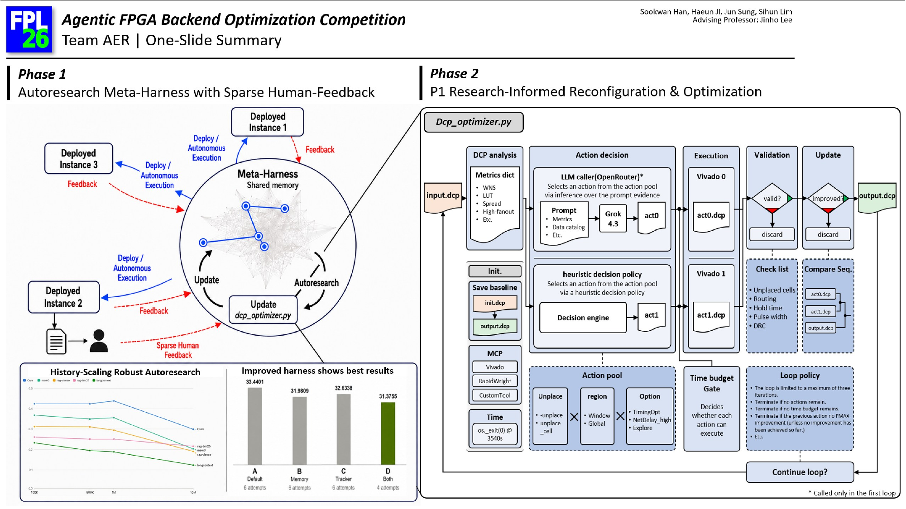
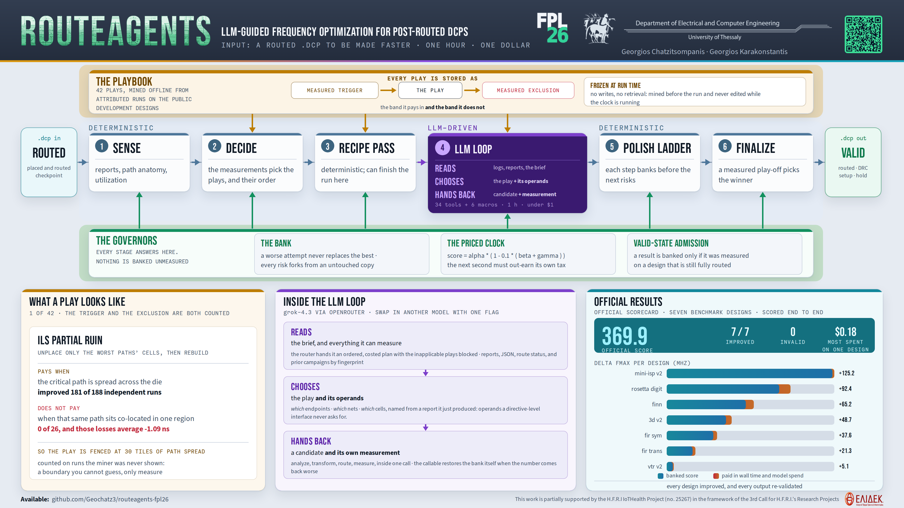
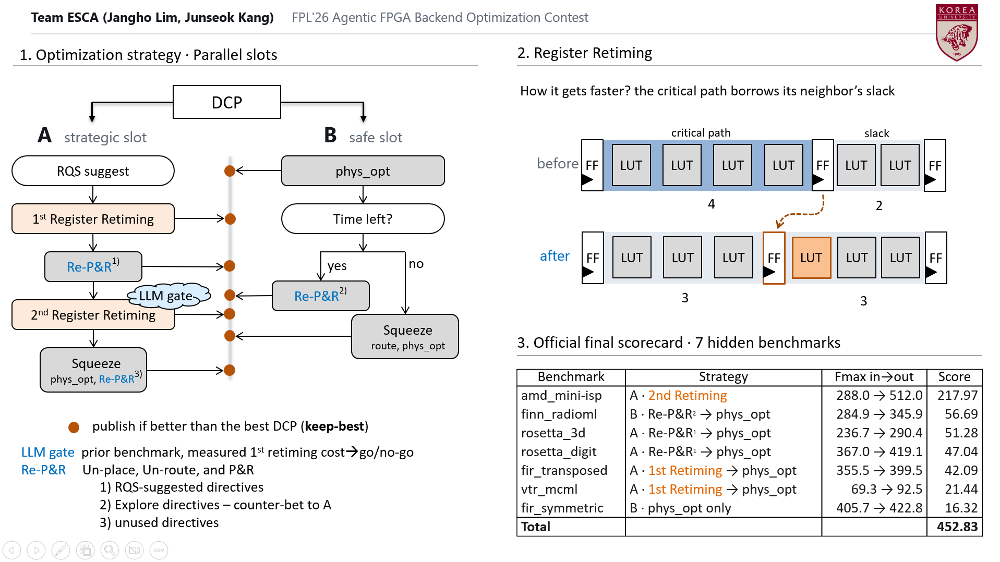
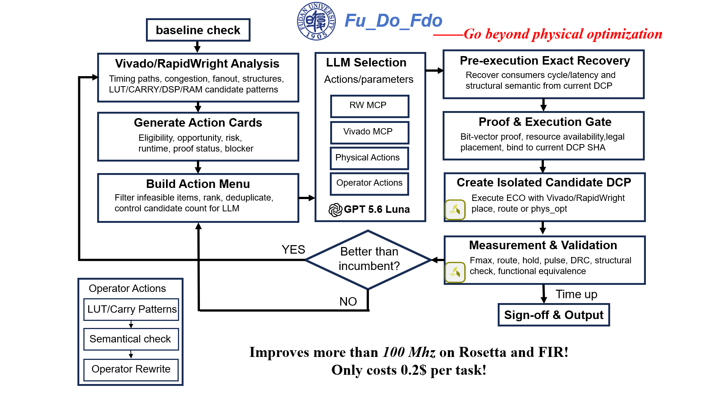
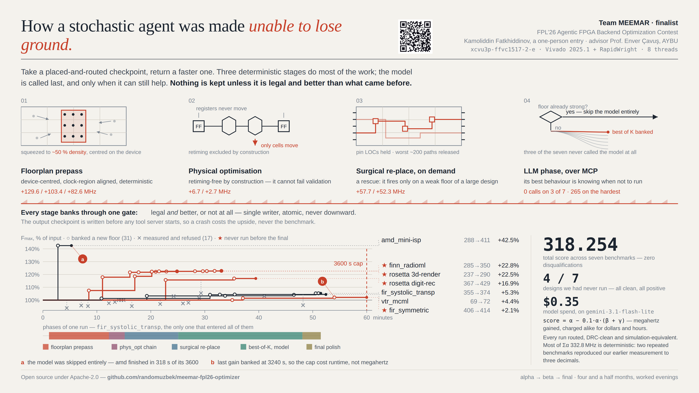

# Contest Results

## Final Submission Results & Rankings

Final submissions were evaluated on the seven benchmarks described on
the [Benchmarks](benchmarks.html#benchmarks-used-for-final-evaluation) page.
As with the beta round, teams are ranked within each benchmark by descending
score (standard competition ranking, `1, 2, 2, 4`), and the overall ranking is
determined by the ascending arithmetic mean of the per-benchmark ranks. See
the [Scoring Criteria](score.html) page for the full scoring formula.

📄 The full results announcement and presentation from FPL 2026 is available
here: [`2026-09-09-FPL26-Contest-Results.pdf`](assets/2026-09-09-FPL26-Contest-Results.pdf).

## 🏆 Congratulations to the Winners! 🏆

The following five teams placed highest in the final round and are the
prize winners of the FPL'26 Agentic FPGA Backend Optimization Contest.
Each finalist prepared a short slide and video summarizing their approach,
included below.

| Prize | Team | Mean rank | Highlight |
|:---:|---|---:|---|
| 🥇 1st — €3000 | **AER** | 4.286 | Best on FINN RadioML (rank 1) |
| 🥈 2nd — €2000 | **RouteAgents** | 5.000 | Best on Rosetta Digit-Rec (rank 1) |
| 🥉 3rd — €1000 | **ESCA** | 6.286 | Best on VTR MCML (rank 1) |
| 4th — €500 | **Fu_Do_Fdo** | 7.429 | Best on FIR Symmetric (rank 1) |
| 5th — €500 | **MEEMAR** | 7.714 | 2nd best on FINN RadioML |

*(50% of each prize is conditional on the winning entry being open-sourced
under a permissive license within 30 days of the award announcement, per the
[contest rules](index.html#prizes). All five finalists have agreed to open
source their submissions; repository links are provided below and will be
updated as they are published.)*

### 1st Place: AER

<video width="100%" controls preload="metadata">
  <source src="assets/finalists/AER_video.mp4" type="video/mp4">
  Your browser does not support the video tag.
</video>

**Open-source repository:** _TBD — coming soon_

### 2nd Place: RouteAgents

<video width="100%" controls preload="metadata">
  <source src="assets/finalists/RouteAgents_video.mp4" type="video/mp4">
  Your browser does not support the video tag.
</video>

**Open-source repository:** [github.com/Geochatz3/routeagents-fpl26](https://github.com/Geochatz3/routeagents-fpl26)

### 3rd Place: ESCA

<video width="100%" controls preload="metadata">
  <source src="assets/finalists/ESCA_video.mp4" type="video/mp4">
  Your browser does not support the video tag.
</video>

**Open-source repository:** _TBD — coming soon_

### 4th Place: Fu_Do_Fdo

<video width="100%" controls preload="metadata">
  <source src="assets/finalists/Fu_Do_Fdo_video.mp4" type="video/mp4">
  Your browser does not support the video tag.
</video>

**Open-source repository:** _TBD — coming soon_

### 5th Place: MEEMAR

<video width="100%" controls preload="metadata">
  <source src="assets/finalists/MEEMAR_video.mp4" type="video/mp4">
  Your browser does not support the video tag.
</video>

**Open-source repository:** [github.com/randomuzbek/meemar-fpl26-optimizer](https://github.com/randomuzbek/meemar-fpl26-optimizer)

### Per-Benchmark Rankings

The complete rankings for each final-round benchmark are provided below,
restricted to the 24 official contest entrants. Teams are ranked within each
benchmark by descending score, with standard competition ranking used for
ties (`1, 2, 2, 4`).

#### AMD Mini-ISP

| Rank | Team | Score |
|---:|---|---:|
| 1 | Fmaximizers | 246.649 |
| 2 | ESCA | 217.967 |
| 3 | RouteAgents | 123.793 |
| 4 | MEEMAR | 121.411 |
| 5 | UTDA_FPGA | 121.131 |
| 6 | Elios_Lab | 120.107 |
| 7 | AER | 116.773 |
| 8 | NanoLLM | 116.489 |
| 9 | Berkeley_Gobblers | 116.136 |
| 10 | Novi_CAD | 115.649 |
| 11 | BSC-ANO | 114.533 |
| 12 | LogicFlow | 113.779 |
| 13 | Synthesis_Sages | 113.223 |
| 14 | FLY_FPGA | 112.825 |
| 15 | Net-Surgeon | 112.540 |
| 16 | critpath | 112.387 |
| 17 | CUFO | 110.929 |
| 18 | OOM_Slayers | 107.587 |
| 19 | nagar | 101.967 |
| 20 | DaKaiMen | 100.766 |
| 21 | ParaGato_Labs | 86.632 |
| 22 | Fu_Do_Fdo | 78.776 |
| 23 | Microprocessor_Lab | 0.000 |
| 23 | Morpheus | 0.000 |

#### FINN RadioML

| Rank | Team | Score |
|---:|---|---:|
| 1 | AER | 62.454 |
| 2 | MEEMAR | 61.409 |
| 3 | Elios_Lab | 60.106 |
| 4 | BSC-ANO | 59.780 |
| 5 | RouteAgents | 59.025 |
| 6 | CUFO | 58.342 |
| 7 | Novi_CAD | 57.988 |
| 8 | Net-Surgeon | 57.567 |
| 9 | Fu_Do_Fdo | 56.871 |
| 10 | ESCA | 56.694 |
| 11 | nagar | 56.501 |
| 12 | Synthesis_Sages | 55.342 |
| 13 | ParaGato_Labs | 52.826 |
| 14 | LogicFlow | 51.275 |
| 15 | OOM_Slayers | 50.977 |
| 16 | UTDA_FPGA | 50.513 |
| 17 | FLY_FPGA | 49.404 |
| 18 | critpath | 48.955 |
| 19 | Fmaximizers | 46.062 |
| 20 | Berkeley_Gobblers | 34.235 |
| 21 | NanoLLM | 12.272 |
| 22 | Morpheus | 11.862 |
| 23 | DaKaiMen | 11.210 |
| 24 | Microprocessor_Lab | 0.000 |

#### FIR Symmetric

| Rank | Team | Score |
|---:|---|---:|
| 1 | Fu_Do_Fdo | 53.055 |
| 2 | AER | 53.014 |
| 3 | Novi_CAD | 47.575 |
| 4 | Fmaximizers | 45.039 |
| 5 | Net-Surgeon | 39.194 |
| 6 | RouteAgents | 34.662 |
| 7 | DaKaiMen | 29.898 |
| 8 | Synthesis_Sages | 29.783 |
| 9 | NanoLLM | 27.573 |
| 10 | LogicFlow | 27.211 |
| 11 | CUFO | 23.405 |
| 12 | nagar | 21.768 |
| 13 | ESCA | 16.317 |
| 14 | FLY_FPGA | 16.118 |
| 15 | critpath | 15.636 |
| 16 | ParaGato_Labs | 15.438 |
| 17 | UTDA_FPGA | 15.382 |
| 18 | MEEMAR | 7.702 |
| 19 | Berkeley_Gobblers | 7.138 |
| 20 | BSC-ANO | 0.000 |
| 20 | Elios_Lab | 0.000 |
| 20 | Microprocessor_Lab | 0.000 |
| 20 | Morpheus | 0.000 |
| 20 | OOM_Slayers | 0.000 |

#### FIR Transposed

| Rank | Team | Score |
|---:|---|---:|
| 1 | Fu_Do_Fdo | 42.809 |
| 2 | ESCA | 42.092 |
| 3 | Novi_CAD | 22.422 |
| 4 | AER | 21.494 |
| 5 | Morpheus | 19.686 |
| 6 | RouteAgents | 19.482 |
| 7 | Fmaximizers | 18.405 |
| 8 | ParaGato_Labs | 18.197 |
| 9 | Elios_Lab | 17.807 |
| 10 | critpath | 17.007 |
| 11 | MEEMAR | 16.836 |
| 12 | CUFO | 16.556 |
| 13 | UTDA_FPGA | 14.018 |
| 14 | Net-Surgeon | 13.661 |
| 15 | Synthesis_Sages | 11.745 |
| 16 | FLY_FPGA | 11.463 |
| 17 | OOM_Slayers | 10.643 |
| 18 | LogicFlow | 9.907 |
| 19 | BSC-ANO | 7.096 |
| 20 | DaKaiMen | 5.469 |
| 21 | nagar | 0.429 |
| 22 | Berkeley_Gobblers | 0.000 |
| 22 | Microprocessor_Lab | 0.000 |
| 22 | NanoLLM | 0.000 |

#### Rosetta 3D-Render

| Rank | Team | Score |
|---:|---|---:|
| 1 | Fu_Do_Fdo | 77.643 |
| 2 | LogicFlow | 60.786 |
| 3 | Novi_CAD | 54.626 |
| 4 | AER | 53.379 |
| 5 | BSC-ANO | 53.158 |
| 6 | ESCA | 51.275 |
| 7 | MEEMAR | 50.720 |
| 8 | Elios_Lab | 48.965 |
| 9 | critpath | 45.329 |
| 10 | Synthesis_Sages | 44.809 |
| 11 | CUFO | 44.435 |
| 12 | RouteAgents | 44.222 |
| 13 | ParaGato_Labs | 44.187 |
| 14 | Net-Surgeon | 40.912 |
| 15 | OOM_Slayers | 40.524 |
| 16 | UTDA_FPGA | 39.303 |
| 17 | DaKaiMen | 36.714 |
| 18 | Morpheus | 35.957 |
| 19 | Fmaximizers | 33.876 |
| 20 | FLY_FPGA | 29.392 |
| 21 | nagar | 23.157 |
| 22 | Berkeley_Gobblers | 1.576 |
| 23 | Microprocessor_Lab | 0.000 |
| 23 | NanoLLM | 0.000 |

#### Rosetta Digit-Rec

| Rank | Team | Score |
|---:|---|---:|
| 1 | RouteAgents | 84.048 |
| 2 | BSC-ANO | 68.817 |
| 3 | MEEMAR | 57.389 |
| 4 | CUFO | 56.084 |
| 5 | UTDA_FPGA | 52.908 |
| 6 | ParaGato_Labs | 52.449 |
| 7 | Fmaximizers | 51.911 |
| 8 | DaKaiMen | 51.792 |
| 9 | AER | 50.718 |
| 10 | ESCA | 47.038 |
| 11 | Fu_Do_Fdo | 46.031 |
| 12 | FLY_FPGA | 43.651 |
| 13 | Synthesis_Sages | 37.904 |
| 14 | critpath | 33.035 |
| 15 | Berkeley_Gobblers | 31.943 |
| 16 | LogicFlow | 31.757 |
| 17 | Morpheus | 30.550 |
| 18 | nagar | 25.617 |
| 19 | Net-Surgeon | 16.668 |
| 20 | Elios_Lab | 14.671 |
| 21 | Microprocessor_Lab | 0.000 |
| 21 | NanoLLM | 0.000 |
| 21 | Novi_CAD | 0.000 |
| 21 | OOM_Slayers | 0.000 |

#### VTR MCML

| Rank | Team | Score |
|---:|---|---:|
| 1 | ESCA | 21.442 |
| 2 | RouteAgents | 4.668 |
| 3 | AER | 4.083 |
| 4 | Morpheus | 4.023 |
| 5 | Fmaximizers | 3.637 |
| 6 | critpath | 3.303 |
| 7 | Fu_Do_Fdo | 3.127 |
| 8 | UTDA_FPGA | 2.936 |
| 9 | MEEMAR | 2.787 |
| 10 | CUFO | 2.585 |
| 11 | OOM_Slayers | 2.365 |
| 12 | nagar | 2.168 |
| 13 | Elios_Lab | 2.147 |
| 14 | Synthesis_Sages | 2.060 |
| 15 | BSC-ANO | 1.954 |
| 16 | LogicFlow | 1.874 |
| 17 | Net-Surgeon | 1.735 |
| 18 | ParaGato_Labs | 1.716 |
| 19 | FLY_FPGA | 1.715 |
| 20 | Novi_CAD | 1.710 |
| 21 | DaKaiMen | 1.621 |
| 22 | NanoLLM | 1.388 |
| 23 | Berkeley_Gobblers | 0.599 |
| 24 | Microprocessor_Lab | 0.000 |

## Beta Submission Results & Rankings

Of the 48 teams competing before the beta deadline, 37 made beta submissions.
The following table shows the top 25 teams from the FPL'26 beta evaluation.
These 25 teams will proceed to the final round.

Teams are ranked within each benchmark by descending score, with identical
values tied. The overall ranking is determined by the ascending arithmetic mean
of the five benchmark ranks. Standard competition ranking is used for ties
(`1, 2, 2, 4`).

Each benchmark entry is shown as **rank (score)**.

| Overall | Team | Mean rank | AMD Mini-ISP rank (score) | BOOM SoC rank (score) | FIR Systolic rank (score) | Rosetta Optical Flow rank (score) | VTR MCML rank (score) |
|---:|---|---:|---:|---:|---:|---:|---:|
| **1** | **ESCA** | **3.600** | 1 (105.365) | 9 (6.165) | 2 (21.413) | 5 (27.992) | 1 (4.789) |
| **2** | **MEEMAR** | **7.600** | 4 (102.240) | 3 (11.235) | 11 (10.711) | 14 (16.711) | 6 (2.660) |
| **3** | **Morpheus** | **9.400** | 7 (100.454) | 15 (3.263) | 4 (14.266) | 4 (28.330) | 17 (1.730) |
| **4** | **CUFO** | **10.000** | 24 (82.158) | 4 (10.669) | 5 (13.855) | 8 (24.254) | 9 (2.129) |
| **4** | **UTDA_FPGA** | **10.000** | 3 (103.053) | 6 (9.031) | 12 (10.510) | 6 (27.954) | 23 (0.057) |
| **6** | **AER** | **10.200** | 16 (94.485) | 11 (4.068) | 3 (19.673) | 2 (32.096) | 19 (1.653) |
| **7** | **OOM_Slayers** | **10.400** | 5 (101.445) | 20 (1.462) | 17 (2.628) | 3 (30.103) | 7 (2.232) |
| **8** | **Elios_Lab** | **10.600** | 9 (98.379) | 21 (0.000) | 8 (12.931) | 13 (18.109) | 2 (3.414) |
| **9** | **Novi_CAD** | **10.800** | 11 (98.187) | 12 (3.925) | 1 (22.389) | 26 (0.000) | 4 (2.941) |
| **10** | **critpath** | **11.200** | 14 (95.286) | 16 (2.987) | 7 (13.003) | 11 (19.179) | 8 (2.139) |
| **11** | **DaKaiMen** | **11.400** | 13 (95.297) | 5 (10.415) | 21 (0.000) | 7 (24.407) | 11 (1.984) |
| **12** | **Fu_Do_Fdo** | **11.600** | 19 (91.365) | 10 (5.214) | 10 (10.860) | 16 (16.125) | 3 (3.283) |
| **13** | **nagar** | **12.000** | 15 (95.260) | 2 (12.700) | 15 (9.631) | 10 (20.354) | 18 (1.681) |
| **14** | **RouteAgents** | **12.800** | 20 (89.316) | 21 (0.000) | 9 (12.057) | 9 (23.658) | 5 (2.742) |
| **15** | **LogicFlow** | **15.400** | 18 (92.563) | 21 (0.000) | 13 (9.960) | 1 (40.510) | 24 (0.000) |
| **16** | **DSALFlow** | **15.800** | 17 (94.481) | 14 (3.301) | 14 (9.792) | 20 (8.582) | 14 (1.891) |
| **17** | **NanoLLM** | **16.000** | 8 (98.576) | 18 (2.479) | 18 (1.756) | 12 (19.078) | 24 (0.000) |
| **18** | **FLY_FPGA** | **16.200** | 6 (100.489) | 21 (0.000) | 21 (0.000) | 17 (14.693) | 16 (1.744) |
| **19** | **Microprocessor_Lab** | **17.000** | 31 (0.000) | 1 (13.873) | 16 (5.661) | 24 (0.408) | 13 (1.976) |
| **20** | **Fmaximizers** | **17.800** | 12 (97.416) | 8 (6.573) | 21 (0.000) | 26 (0.000) | 22 (0.988) |
| **21** | **Synthesis_Sages** | **18.000** | 21 (87.903) | 19 (2.454) | 21 (0.000) | 19 (9.250) | 10 (2.013) |
| **22** | **ParaGato_Labs** | **18.400** | 27 (67.821) | 7 (6.995) | 21 (0.000) | 22 (0.419) | 15 (1.847) |
| **23** | **Berkeley_Gobblers** | **18.800** | 2 (104.492) | 21 (0.000) | 21 (0.000) | 26 (0.000) | 24 (0.000) |
| **24** | **BSC-ANO** | **19.000** | 26 (67.948) | 13 (3.598) | 21 (0.000) | 15 (16.530) | 20 (1.408) |
| **25** | **Net-Surgeon** | **19.600** | 25 (79.035) | 17 (2.482) | 6 (13.217) | 26 (0.000) | 24 (0.000) |

### Per-Benchmark Rankings

The complete rankings for each beta benchmark are provided below so that every
team can reproduce its mean benchmark rank.

#### AMD Mini-ISP

| Rank | Team | Score |
|---:|---|---:|
| 1 | ESCA | 105.365 |
| 2 | Berkeley_Gobblers | 104.492 |
| 3 | UTDA_FPGA | 103.053 |
| 4 | MEEMAR | 102.240 |
| 5 | OOM_Slayers | 101.445 |
| 6 | FLY_FPGA | 100.489 |
| 7 | Morpheus | 100.454 |
| 8 | NanoLLM | 98.576 |
| 9 | Elios_Lab | 98.379 |
| 10 | APRIL_AI_Hub | 98.333 |
| 11 | Novi_CAD | 98.187 |
| 12 | Fmaximizers | 97.416 |
| 13 | DaKaiMen | 95.297 |
| 14 | critpath | 95.286 |
| 15 | nagar | 95.260 |
| 16 | AER | 94.485 |
| 17 | DSALFlow | 94.481 |
| 18 | LogicFlow | 92.563 |
| 19 | Fu_Do_Fdo | 91.365 |
| 20 | RouteAgents | 89.316 |
| 21 | Synthesis_Sages | 87.903 |
| 22 | team_1234567 | 87.878 |
| 23 | Deep_Thought_42 | 84.262 |
| 24 | CUFO | 82.158 |
| 25 | Net-Surgeon | 79.035 |
| 26 | BSC-ANO | 67.948 |
| 27 | ParaGato_Labs | 67.821 |
| 28 | Positive_Slack | 67.815 |
| 29 | TOFU | 61.994 |
| 30 | Llampayec | 19.683 |
| 31 | Clock_Kings | 0.000 |
| 31 | ICCLab | 0.000 |
| 31 | Innova_IRV | 0.000 |
| 31 | Microprocessor_Lab | 0.000 |
| 31 | OptimersPRine | 0.000 |
| 31 | TimingClosers | 0.000 |
| 31 | Voltedge | 0.000 |

#### BOOM SoC

| Rank | Team | Score |
|---:|---|---:|
| 1 | Microprocessor_Lab | 13.873 |
| 2 | nagar | 12.700 |
| 3 | MEEMAR | 11.235 |
| 4 | CUFO | 10.669 |
| 5 | DaKaiMen | 10.415 |
| 6 | UTDA_FPGA | 9.031 |
| 7 | ParaGato_Labs | 6.995 |
| 8 | Fmaximizers | 6.573 |
| 9 | ESCA | 6.165 |
| 10 | Fu_Do_Fdo | 5.214 |
| 11 | AER | 4.068 |
| 12 | Novi_CAD | 3.925 |
| 13 | BSC-ANO | 3.598 |
| 14 | DSALFlow | 3.301 |
| 15 | Morpheus | 3.263 |
| 16 | critpath | 2.987 |
| 17 | Net-Surgeon | 2.482 |
| 18 | NanoLLM | 2.479 |
| 19 | Synthesis_Sages | 2.454 |
| 20 | OOM_Slayers | 1.462 |
| 21 | APRIL_AI_Hub | 0.000 |
| 21 | Berkeley_Gobblers | 0.000 |
| 21 | Clock_Kings | 0.000 |
| 21 | Deep_Thought_42 | 0.000 |
| 21 | Elios_Lab | 0.000 |
| 21 | FLY_FPGA | 0.000 |
| 21 | ICCLab | 0.000 |
| 21 | Innova_IRV | 0.000 |
| 21 | Llampayec | 0.000 |
| 21 | LogicFlow | 0.000 |
| 21 | OptimersPRine | 0.000 |
| 21 | Positive_Slack | 0.000 |
| 21 | RouteAgents | 0.000 |
| 21 | team_1234567 | 0.000 |
| 21 | TimingClosers | 0.000 |
| 21 | TOFU | 0.000 |
| 21 | Voltedge | 0.000 |

#### FIR Systolic

| Rank | Team | Score |
|---:|---|---:|
| 1 | Novi_CAD | 22.389 |
| 2 | ESCA | 21.413 |
| 3 | AER | 19.673 |
| 4 | Morpheus | 14.266 |
| 5 | CUFO | 13.855 |
| 6 | Net-Surgeon | 13.217 |
| 7 | critpath | 13.003 |
| 8 | Elios_Lab | 12.931 |
| 9 | RouteAgents | 12.057 |
| 10 | Fu_Do_Fdo | 10.860 |
| 11 | MEEMAR | 10.711 |
| 12 | UTDA_FPGA | 10.510 |
| 13 | LogicFlow | 9.960 |
| 14 | DSALFlow | 9.792 |
| 15 | nagar | 9.631 |
| 16 | Microprocessor_Lab | 5.661 |
| 17 | OOM_Slayers | 2.628 |
| 18 | NanoLLM | 1.756 |
| 19 | OptimersPRine | 1.261 |
| 20 | TOFU | 0.447 |
| 21 | APRIL_AI_Hub | 0.000 |
| 21 | Berkeley_Gobblers | 0.000 |
| 21 | BSC-ANO | 0.000 |
| 21 | Clock_Kings | 0.000 |
| 21 | DaKaiMen | 0.000 |
| 21 | Deep_Thought_42 | 0.000 |
| 21 | FLY_FPGA | 0.000 |
| 21 | Fmaximizers | 0.000 |
| 21 | ICCLab | 0.000 |
| 21 | Innova_IRV | 0.000 |
| 21 | Llampayec | 0.000 |
| 21 | ParaGato_Labs | 0.000 |
| 21 | Positive_Slack | 0.000 |
| 21 | Synthesis_Sages | 0.000 |
| 21 | team_1234567 | 0.000 |
| 21 | TimingClosers | 0.000 |
| 21 | Voltedge | 0.000 |

#### Rosetta Optical Flow

| Rank | Team | Score |
|---:|---|---:|
| 1 | LogicFlow | 40.510 |
| 2 | AER | 32.096 |
| 3 | OOM_Slayers | 30.103 |
| 4 | Morpheus | 28.330 |
| 5 | ESCA | 27.992 |
| 6 | UTDA_FPGA | 27.954 |
| 7 | DaKaiMen | 24.407 |
| 8 | CUFO | 24.254 |
| 9 | RouteAgents | 23.658 |
| 10 | nagar | 20.354 |
| 11 | critpath | 19.179 |
| 12 | NanoLLM | 19.078 |
| 13 | Elios_Lab | 18.109 |
| 14 | MEEMAR | 16.711 |
| 15 | BSC-ANO | 16.530 |
| 16 | Fu_Do_Fdo | 16.125 |
| 17 | FLY_FPGA | 14.693 |
| 18 | Voltedge | 13.754 |
| 19 | Synthesis_Sages | 9.250 |
| 20 | DSALFlow | 8.582 |
| 21 | Positive_Slack | 1.552 |
| 22 | ParaGato_Labs | 0.419 |
| 23 | Llampayec | 0.418 |
| 24 | Microprocessor_Lab | 0.408 |
| 25 | TOFU | 0.374 |
| 26 | APRIL_AI_Hub | 0.000 |
| 26 | Berkeley_Gobblers | 0.000 |
| 26 | Clock_Kings | 0.000 |
| 26 | Deep_Thought_42 | 0.000 |
| 26 | Fmaximizers | 0.000 |
| 26 | ICCLab | 0.000 |
| 26 | Innova_IRV | 0.000 |
| 26 | Net-Surgeon | 0.000 |
| 26 | Novi_CAD | 0.000 |
| 26 | OptimersPRine | 0.000 |
| 26 | team_1234567 | 0.000 |
| 26 | TimingClosers | 0.000 |

#### VTR MCML

| Rank | Team | Score |
|---:|---|---:|
| 1 | ESCA | 4.789 |
| 2 | Elios_Lab | 3.414 |
| 3 | Fu_Do_Fdo | 3.283 |
| 4 | Novi_CAD | 2.941 |
| 5 | RouteAgents | 2.742 |
| 6 | MEEMAR | 2.660 |
| 7 | OOM_Slayers | 2.232 |
| 8 | critpath | 2.139 |
| 9 | CUFO | 2.129 |
| 10 | Synthesis_Sages | 2.013 |
| 11 | DaKaiMen | 1.984 |
| 12 | Positive_Slack | 1.983 |
| 13 | Microprocessor_Lab | 1.976 |
| 14 | DSALFlow | 1.891 |
| 15 | ParaGato_Labs | 1.847 |
| 16 | FLY_FPGA | 1.744 |
| 17 | Morpheus | 1.730 |
| 18 | nagar | 1.681 |
| 19 | AER | 1.653 |
| 20 | BSC-ANO | 1.408 |
| 21 | Deep_Thought_42 | 1.380 |
| 22 | Fmaximizers | 0.988 |
| 23 | UTDA_FPGA | 0.057 |
| 24 | APRIL_AI_Hub | 0.000 |
| 24 | Berkeley_Gobblers | 0.000 |
| 24 | Clock_Kings | 0.000 |
| 24 | ICCLab | 0.000 |
| 24 | Innova_IRV | 0.000 |
| 24 | Llampayec | 0.000 |
| 24 | LogicFlow | 0.000 |
| 24 | NanoLLM | 0.000 |
| 24 | Net-Surgeon | 0.000 |
| 24 | OptimersPRine | 0.000 |
| 24 | team_1234567 | 0.000 |
| 24 | TimingClosers | 0.000 |
| 24 | TOFU | 0.000 |
| 24 | Voltedge | 0.000 |
